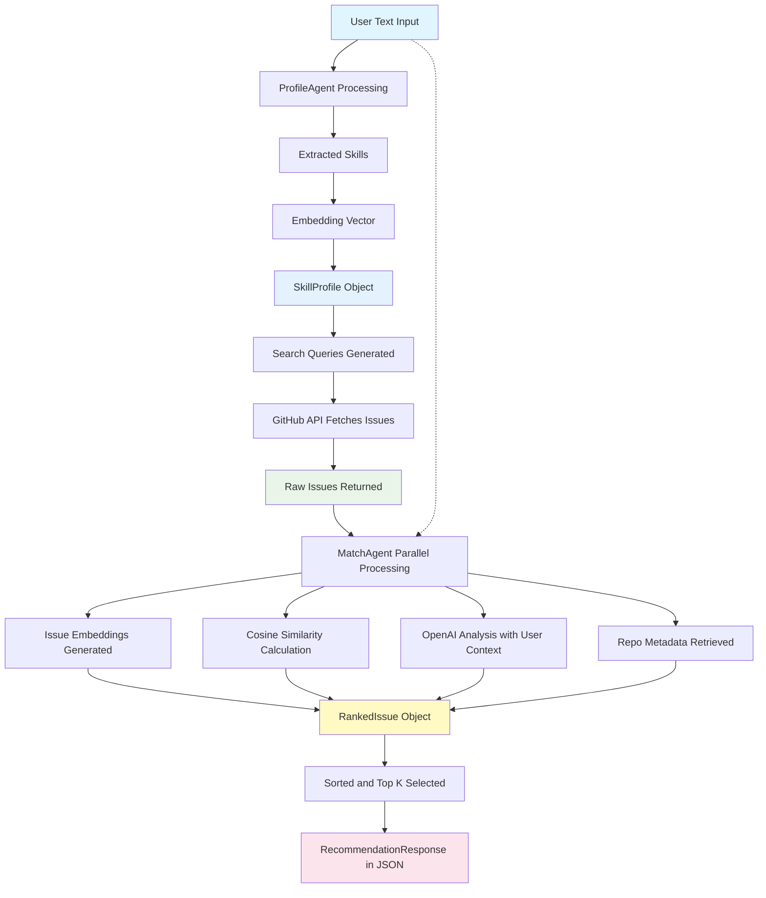

# open-source-buddy
AI-powered assistant for finding open-source issues that match your skills.

## Features

- **Skill Extraction**: Uses OpenAI Agents SDK to extract technical skills from natural language descriptions
- **Smart Search**: Searches GitHub for relevant open-source issues using extracted skills
- **Intelligent Matching**: Ranks issues based on skill similarity, provides difficulty analysis, and generates personalized summaries based on user context
- **Complete Pipeline**: End-to-end recommendation system from text input to ranked issue suggestions
- **REST API**: FastAPI-based web service with health checks and recommendation endpoints

## Setup

1. **Prerequisites**: Python 3.12+

2. **Install dependencies**:
   ```bash
   uv venv
   source .venv/bin/activate
   uv pip install -e ".[dev]"
   ```

3. **Configure environment**:
   ```bash
   cp .env.template .env
   # Edit .env with your GitHub token and OpenAI API key
   ```

## Usage

### FastAPI Web Server

Start the development server:

```bash
# Using the CLI script
uv run open-source-buddy

# Or directly with uvicorn
uv run uvicorn app.main:app --reload --host 0.0.0.0 --port 8000
```

The API will be available at `http://localhost:8000` with:
- **Interactive docs**: `http://localhost:8000/docs`
- **OpenAPI schema**: `http://localhost:8000/openapi.json`

#### API Endpoints

**Health Check**
```bash
GET /healthz
```
Returns: `{"status": "ok"}`

**Get Recommendations**
```bash
POST /recommend
Content-Type: application/json

{
  "skills": "I'm a Python developer with experience in FastAPI, Django, and machine learning. I've worked with scikit-learn and pandas."
}
```

Returns:
```json
{
  "items": [
    {
      "id": 123,
      "url": "https://github.com/owner/repo/issues/123",
      "title": "Add ML model training pipeline",
      "body": "We need to implement...",
      "labels": ["enhancement", "ml"],
      "repo": "owner/repo",
      "score": 0.85,
      "difficulty": "Medium",
      "summary": "Machine learning feature implementation"
    }
  ]
}
```

### Programmatic Usage

```python
import asyncio
from app.pipeline import recommend

async def main():
    user_description = """
    I'm a Python developer with experience in FastAPI, Django, 
    and machine learning. I've worked with scikit-learn and pandas.
    """
    
    # Get top 5 recommendations
    result = await recommend(user_description, top_k=5)
    
    for issue in result.items:
        print(f"Issue: {issue.title}")
        print(f"Repository: {issue.repo}")
        print(f"Difficulty: {issue.difficulty}")
        print(f"Match Score: {issue.score:.2f}")
        print(f"URL: {issue.url}")
        print("---")

asyncio.run(main())
```

### Run Example

```bash
# Make sure you have API keys in .env file
uv run python examples/pipeline_example.py
```

## Architecture

The system consists of three main agents:

1. **ProfileAgent** (`custom_agents/profile_agent.py`): Extracts technical skills from user text using OpenAI Agents SDK
2. **SearchAgent** (`custom_agents/search_agent.py`): Searches GitHub for issues using extracted skills as keywords
3. **MatchAgent** (`custom_agents/match_agent.py`): Ranks issues based on semantic similarity, analyzes difficulty, and provides personalized summaries using the original user context

The `app/pipeline.py` module orchestrates these agents to provide end-to-end recommendations.

The `app/main.py` module provides a FastAPI web service with REST endpoints for health checks and recommendations.

### System Flow



The diagram shows how user input flows through the three-agent pipeline, with the key enhancement that the original user text provides additional context to the MatchAgent for more personalized issue analysis.

## Testing

Run the test suite:

```bash
uv run pytest
```

Run specific test files:

```bash
uv run pytest tests/test_pipeline.py -v
uv run pytest tests/test_main.py -v
```

## Dependencies

- **Runtime**: FastAPI, uvicorn, OpenAI Agents SDK, PyGithub
- **Dev**: pytest, pytest-asyncio, ruff, black, mypy
